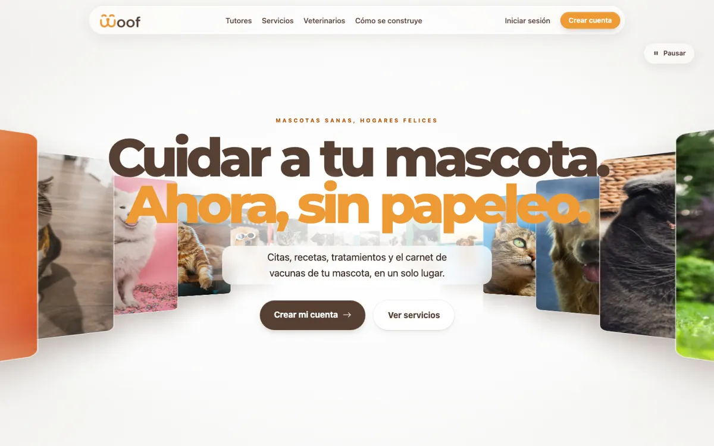
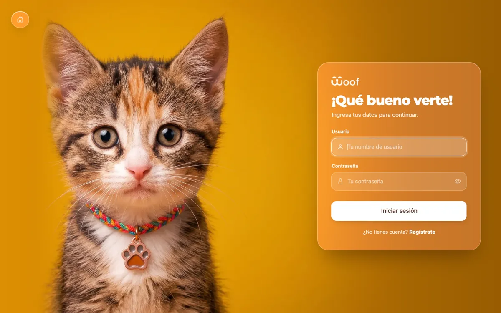
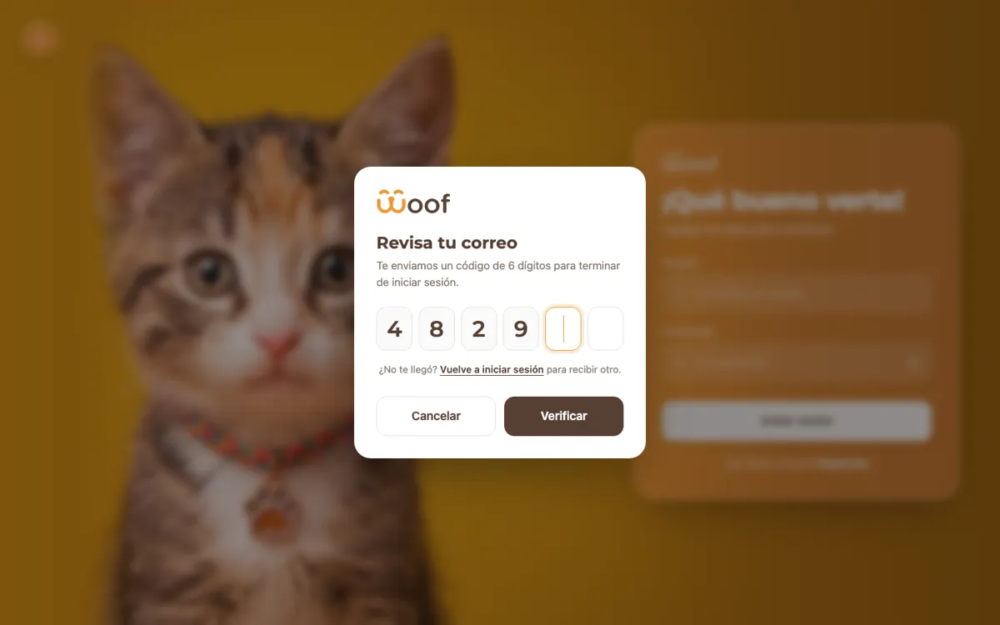
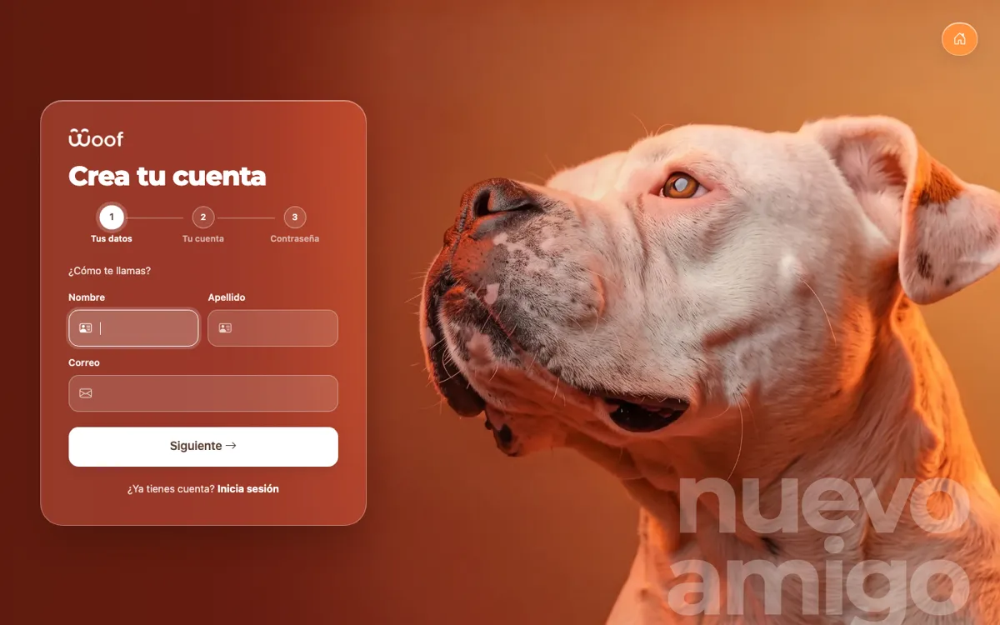

<p align="center">
  
</p>

<h1 align="center">Woof · Sistema veterinario</h1>

<p align="center">
  Citas, recetas, tratamientos y el carnet de vacunas de tu mascota, en un solo lugar.
</p>

<p align="center">
  
  
  
  
  
</p>

<p align="center">
  
</p>

## Índice

- [Descripción](#descripción)
- [Estado del proyecto](#estado-del-proyecto)
- [Funcionalidades](#funcionalidades)
- [Capturas](#capturas)
- [Cómo ejecutarlo](#cómo-ejecutarlo)
- [Pruebas](#pruebas)
- [Tecnologías](#tecnologías)
- [Estructura del proyecto](#estructura-del-proyecto)
- [Documentación](#documentación)
- [Cómo contribuir](#cómo-contribuir)
- [Personas desarrolladoras](#personas-desarrolladoras)
- [Licencia](#licencia)

## Descripción

Woof es una aplicación web para una clínica veterinaria. Los dueños de mascotas registran a sus animales y, en las siguientes fases, podrán agendar citas, ver su historia clínica y llevar el carnet de vacunación sin papeles.

Es el proyecto de la materia **Ingeniería Web**, construido con Django siguiendo el patrón MVC (en Django, MTV: modelo, plantilla y vista).

## Estado del proyecto

🚧 **En desarrollo.** La Entrega 1 está terminada.

| Fase | Alcance | Estado |
|---|---|---|
| Entrega 1 | Portada, registro, login con doble factor, CRUD de mascotas con URLs protegidas | ✅ Terminada |
| Fase 2 | Login con Google y correos con SendGrid | ⏳ Pendiente |
| Fase 3 | Roles, citas, historia clínica y carnet de vacunación | ⏳ Pendiente |

## Funcionalidades

- **Registro de usuarios** en 3 pasos, con validación del teléfono en formato internacional (`+593…`).
- **Inicio de sesión con doble factor:** después de la contraseña, Woof envía un código de 6 dígitos al correo.
  - El código vence a los 5 minutos y se puede usar una sola vez.
  - Se genera con `secrets` y se compara con `secrets.compare_digest`.
- **Cierre de sesión** por POST, protegido con CSRF.
- **CRUD de mascotas:** crear, ver, editar y eliminar, con foto.
  - La foto se reduce a 800 px y se guarda en formato WEBP.
- **URLs protegidas:** sin sesión, cualquier página de mascotas redirige al login y, al terminar, vuelve a la página que se pidió.
- **Cada dueño ve solo sus mascotas:** la mascota de otra persona responde 404.

## Capturas

| Inicio de sesión | Código de verificación |
|---|---|
|  |  |

| Registro |
|---|
|  |

## Cómo ejecutarlo

### Requisitos

- Python **3.12**
- Git
- Una cuenta de Gmail con [contraseña de aplicación](https://myaccount.google.com/apppasswords), para enviar los códigos de acceso.
- Opcional: una base de datos PostgreSQL en [Neon](https://neon.tech). Sin ella, el proyecto usa SQLite.

### Pasos

```bash
git clone https://github.com/josselyn12G/woof-vet-system.git
cd woof-vet-system

python3.12 -m venv .venv
source .venv/bin/activate          # Windows: .venv\Scripts\activate
pip install -r requirements.txt

cp .env.example .env               # y completa los valores (ver abajo)

python manage.py migrate
python manage.py createsuperuser   # opcional: usuario para /admin/
python manage.py runserver
```

Abre http://127.0.0.1:8000/ · Panel de administración: http://127.0.0.1:8000/admin/

### Variables de entorno (`.env`)

| Variable | Para qué sirve | ¿Obligatoria? |
|---|---|---|
| `EMAIL_HOST_USER` | Correo de Gmail que envía los códigos | Sí |
| `EMAIL_HOST_PASSWORD` | Contraseña de aplicación de ese Gmail (16 letras) | Sí |
| `DATABASE_URL` | Conexión a PostgreSQL en Neon | No: sin ella usa SQLite |
| `DJANGO_SECRET_KEY`, `DJANGO_DEBUG`, `DJANGO_ALLOWED_HOSTS` | Configuración para producción | Solo en producción |

> [!WARNING]
> El archivo `.env` tiene contraseñas: nunca lo subas a Git. Ya está en `.gitignore`.

> [!TIP]
> Cada vez que un `git pull` cambie `requirements.txt`, vuelve a ejecutar `pip install -r requirements.txt`.

## Pruebas

```bash
python manage.py test
```

65 pruebas: el modelo de usuario, el registro, el login, el doble factor (código correcto, incorrecto, vencido, con letras y acceso sin contraseña) y el CRUD de mascotas (acceso sin sesión, mascotas de otro dueño y fotos).

Durante las pruebas no se envían correos reales: Django los guarda en memoria.

## Tecnologías

| Área | Tecnología |
|---|---|
| Backend | Python 3.12, Django 5.2 LTS |
| Base de datos | PostgreSQL en Neon (`psycopg`, `dj-database-url`); SQLite en local |
| Correo | Gmail por SMTP |
| Imágenes | Pillow |
| Frontend | Plantillas de Django, Bootstrap 5.3, Bootstrap Icons, Three.js |
| Calidad | Pruebas con `django.test`, Conventional Commits validados con GitHub Actions |

## Estructura del proyecto

```
woof-vet-system/
├── config/              configuración del proyecto (settings.py, urls.py)
├── cuentas/             portada, registro, login, doble factor y cierre de sesión
├── mascotas/            CRUD de mascotas
├── templates/           plantilla base común (base.html)
├── static/              CSS, JavaScript e imágenes comunes
├── docs/                guías del equipo, historias de usuario y modelo de datos
├── .github/             validación de commits y plantilla de Pull Request
├── requirements.txt     dependencias de Python
└── manage.py            comandos de Django
```

## Documentación

| Documento | Contenido |
|---|---|
| [HISTORIAS_DE_USUARIO.md](docs/HISTORIAS_DE_USUARIO.md) | Alcance y criterios de aceptación de cada fase |
| [MODELO_DE_DATOS.md](docs/MODELO_DE_DATOS.md) | Diagrama entidad-relación y campos de cada tabla |
| `Guia_Git_y_CI_CD.docx` · [GIT_WORKFLOW.md](docs/GIT_WORKFLOW.md) | Ramas, commits y el trabajo diario paso a paso |
| `Guia_GitHub_Projects.docx` | Issues, tablero del equipo y cómo se conectan con ramas y PRs |
| `Arquitectura_del_Proyecto.docx` | Qué es cada archivo y cómo crear un módulo nuevo |
| `Crear_un_Modulo_Mascotas.docx` | Tutorial: módulo de mascotas completo (modelo, vistas, URLs, plantillas y pruebas) |
| `Entorno_Virtual_Python.docx` | Qué es el `.venv`, para qué sirve y cómo usarlo |
| `Pruebas_y_CI_CD.docx` · [CI_CD.md](docs/CI_CD.md) | Cómo escribir pruebas y cómo las valida GitHub Actions |

## Cómo contribuir

1. Crea una rama desde `develop` actualizado: `feat/<issue>-<nombre>`.
2. Escribe commits con [Conventional Commits](https://www.conventionalcommits.org/es/v1.0.0/): el tipo en inglés y la descripción en español, por ejemplo `feat(mascotas): agrega la foto de la mascota`.
3. Antes del Pull Request, `python manage.py test` debe pasar.
4. Abre el Pull Request hacia `develop`. Se fusiona con *squash and merge*.

Más detalles en [GIT_WORKFLOW.md](docs/GIT_WORKFLOW.md).

## Personas desarrolladoras

| [<br><sub>Josselyn Guevara</sub>](https://github.com/josselyn12G) | [<br><sub>Adrián Freire</sub>](https://github.com/adripatacon) |
| :---: | :---: |
| Portada, registro, login y doble factor | CRUD de mascotas y URLs protegidas |

## Licencia

Proyecto académico de la materia Ingeniería Web. Todavía no tiene una licencia de código abierto.
