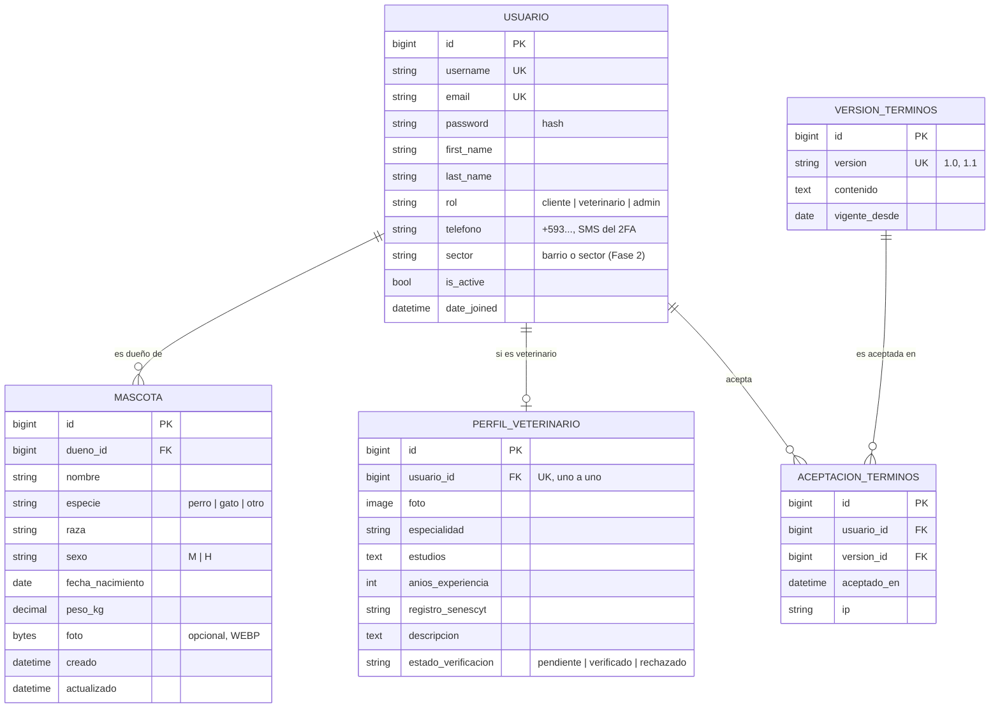
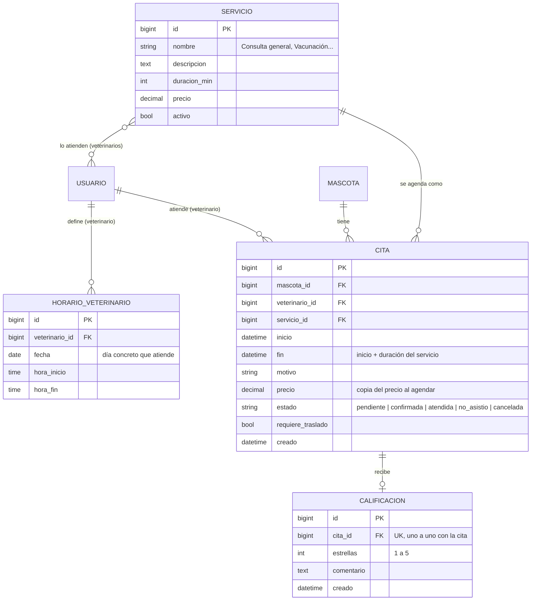
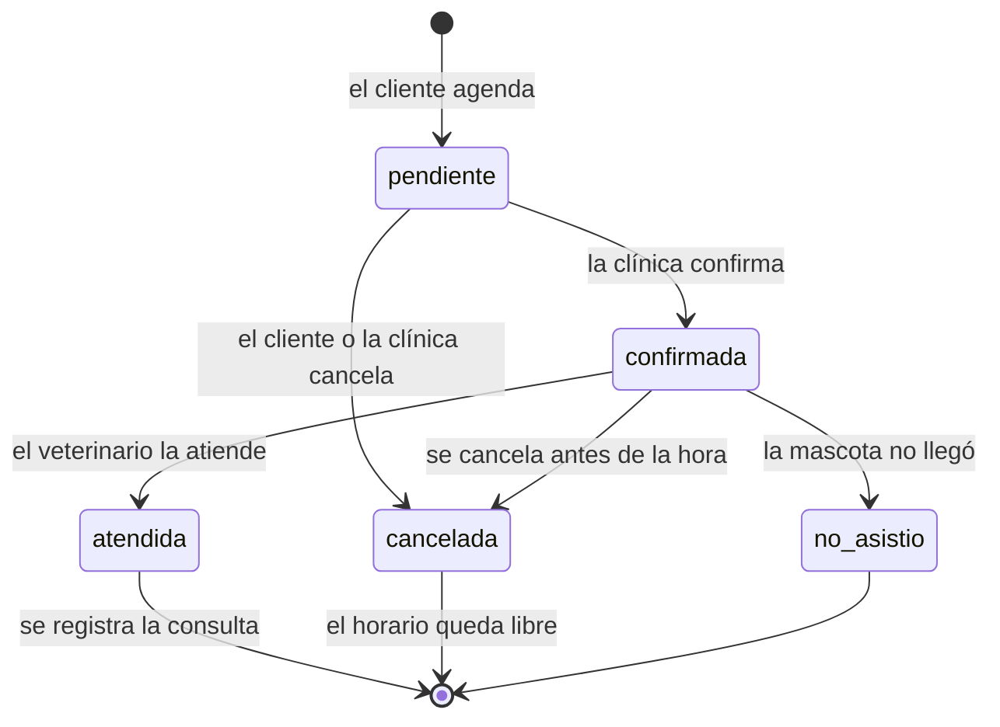
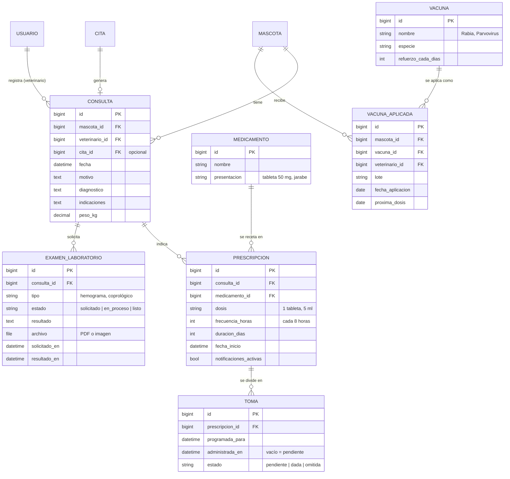
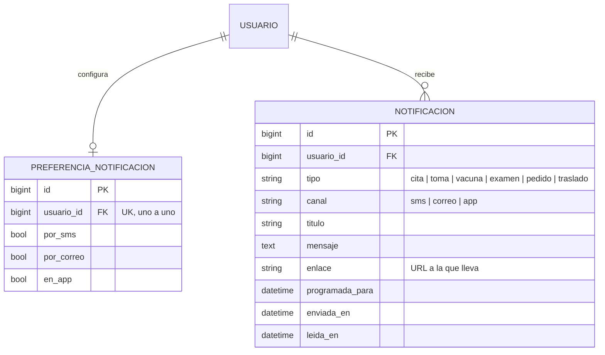
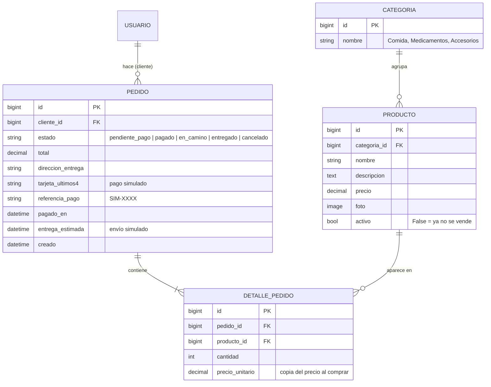
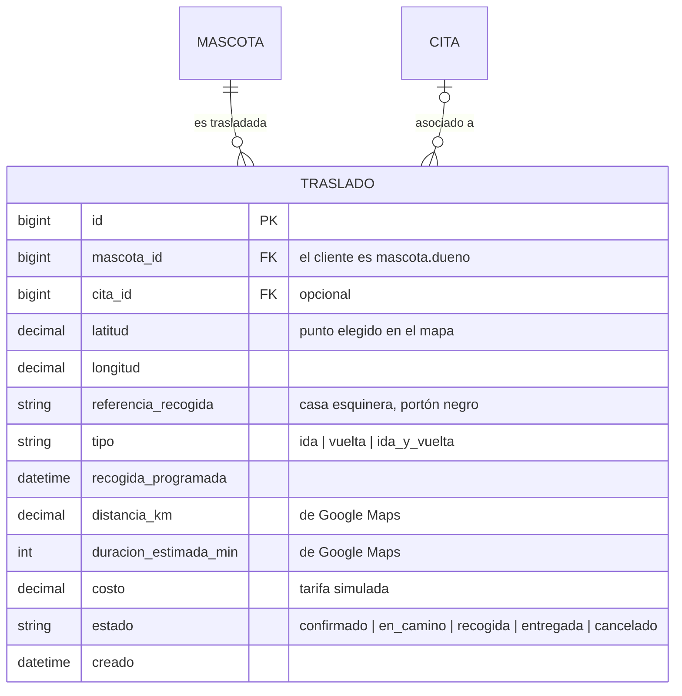
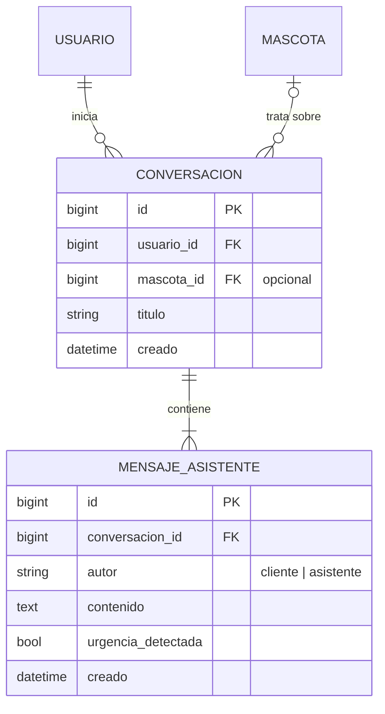

# Modelo de datos — Woof

> **Borrador para revisar con Adrián.** Solo la sección *Entrega 1* se programa para el lunes. El resto es la proyección para las fases siguientes: no se programa todavía, pero conviene que el diseño ya lo contemple para no tener que rehacer tablas.

GitHub y VS Code muestran estos diagramas directamente (mermaid). Si el profe pide imagen, cópienlos en https://mermaid.live y exporten PNG.

Las historias de usuario que justifican cada tabla están en [HISTORIAS_DE_USUARIO.md](HISTORIAS_DE_USUARIO.md) (por ejemplo, *HU-16*).

## Mapa general: apps y tablas

El sistema se divide en **apps de Django**. Cada app es un módulo con sus propios modelos, vistas y plantillas.

| App | Tablas | Fase |
|---|---|---|
| `cuentas` | Usuario, PerfilVeterinario, VersionTerminos, AceptacionTerminos | 1 (Usuario) · 2 · 3 |
| `mascotas` | Mascota | 1 |
| `citas` | Servicio, HorarioVeterinario, Cita, Calificacion | 3 |
| `historial` | Consulta, Medicamento, Prescripcion, Toma, ExamenLaboratorio, Vacuna, VacunaAplicada | 3 |
| `notificaciones` | PreferenciaNotificacion, Notificacion | 3 |
| `tienda` | Categoria, Producto, Pedido, DetallePedido | 4 (pago y envío simulados) |
| `traslados` | Traslado | 4 (simulado) |
| `asistente` | Conversacion, MensajeAsistente | 4 |

Todas las tablas tienen `id` (llave primaria automática de Django). En los diagramas, `FK` es una llave foránea (una "flecha" a otra tabla) y `UK` un valor único.

---

## 1. Cuentas y mascotas

## 2. Citas y servicios

### Ciclo de vida de una cita

Una cita pasa por estados, y **solo una cita atendida genera una consulta**. Las cancelaciones y las inasistencias se quedan en la cita: nunca llegan a la historia clínica.

| Estado final | ¿Genera consulta? | ¿Ocupa el horario? | ¿Cuenta en el dashboard? |
|---|---|---|---|
| `atendida` | Sí, una (HU-19) | Sí | Como atendida y como ingreso |
| `no_asistio` | No | Sí, ya pasó la hora | Como inasistencia |
| `cancelada` | No | **No, se libera** para otro cliente | Como cancelación |

Reglas:
- Solo se puede cancelar una cita `pendiente` o `confirmada`, y antes de su hora de inicio.
- Una cita `atendida` no se puede cancelar.
- La consulta solo se puede registrar si la cita está `atendida` (o sin cita, para una emergencia: `Consulta.cita` es opcional).

## 3. Historia clínica, vacunas y tratamientos

## 4. Notificaciones

## 5. Marketplace (tienda, simulado)

Una sola tienda (la de la clínica). El pago y el envío se simulan, así que sus datos van dentro del mismo `Pedido` en lugar de tablas aparte.

## 6. Traslado de mascotas

## 7. Asistente de IA

---

## Entrega 1: tablas que se programan ahora

### `cuentas.Usuario` (hereda de `AbstractUser`)
Ya trae username, email, password (con hash), first_name, last_name, is_active, is_staff, date_joined. Solo agregamos:

| Campo | Tipo Django | Notas |
|---|---|---|
| rol | `CharField(choices=...)` | `cliente` por defecto. Valores: `cliente`, `veterinario`, `admin` (`veterinario` se usa desde la Fase 3, pero conviene definirlo ya) |
| telefono | `CharField(max_length=16)` | obligatorio, formato internacional `+593...`: ahí llega el código SMS del doble factor |
| email | `EmailField(unique=True)` | lo redefinimos para que sea único (lo necesitaremos para Google y 2FA) |

En `settings.py`: `AUTH_USER_MODEL = "cuentas.Usuario"` **antes de la primera migración propia**.

### `mascotas.Mascota`

| Campo | Tipo Django | Notas |
|---|---|---|
| dueno | `ForeignKey(settings.AUTH_USER_MODEL, on_delete=models.CASCADE, related_name="mascotas")` | se asigna solo en la vista |
| nombre | `CharField(max_length=60)` | obligatorio |
| especie | `CharField(max_length=10, choices=...)` | obligatorio |
| raza | `CharField(max_length=60, blank=True)` | |
| sexo | `CharField(max_length=1, choices=...)` | |
| fecha_nacimiento | `DateField(null=True, blank=True)` | no futura |
| peso_kg | `DecimalField(max_digits=5, decimal_places=2, null=True, blank=True)` | > 0 |
| foto | `BinaryField(null=True, blank=True, editable=False)` | la imagen se guarda dentro de la base (así todos la ven), reducida con Pillow a WEBP de máx. 800 px; se muestra con la URL `/mascotas/<id>/foto/` |
| creado / actualizado | `DateTimeField(auto_now_add / auto_now)` | |

---

## Decisiones de diseño

### Generales
- **Usuario personalizado desde el inicio:** cambiar el modelo de usuario cuando ya hay migraciones obliga a borrar la base.
- **Sin datos repetidos (normalización):** cada dato se guarda en un solo lugar y lo demás se obtiene siguiendo las llaves foráneas. Por ejemplo, `Calificacion` solo apunta a la `Cita`: el cliente que califica es `cita.mascota.dueno` y el veterinario calificado es `cita.veterinario`. Si además se guardaran `cliente_id` y `veterinario_id` en la calificación, podrían quedar distintos a los de la cita y no sabríamos cuál es el correcto. Django sigue esas flechas por nosotros: `Calificacion.objects.filter(cita__veterinario=vet)`. Lo mismo pasa con `Traslado` (el cliente es `mascota.dueno`).
- **Un solo `Usuario` con un campo `rol`**, no una tabla por tipo de persona: todos usan el mismo login, el mismo 2FA y la misma recuperación de contraseña. Lo que es propio de un rol va en un **perfil uno a uno** (`PerfilVeterinario`), así un cliente no carga columnas vacías de estudios o especialidad.
- **Una app por área del negocio** (`citas`, `historial`, `tienda`…): cada integrante trabaja en su app sin pisar los archivos del otro, y cada app se puede probar por separado.

### Seguridad y privacidad
- **El dueño no viaja en el formulario:** la vista lo toma de `request.user`, así nadie puede crear mascotas a nombre de otro.
- **Todas las consultas filtran por dueño** (`Mascota.objects.filter(dueno=request.user)`), por eso la mascota de otro da 404. La misma regla aplica a citas, exámenes, pedidos, traslados y conversaciones.
- **El asistente de IA no consulta la base libremente:** el sistema le entrega solo los datos de las mascotas del usuario que pregunta (especie, edad, peso, vacunas, tratamientos). Nunca recibe datos de otros clientes ni datos personales que no necesita.
- **Nunca se guardan datos de tarjetas,** ni en la simulación: el pedido solo guarda los últimos 4 dígitos y la referencia del pago.
- **Aceptación de términos con versión y fecha:** si los términos cambian, se sabe quién aceptó cuál (Ley Orgánica de Protección de Datos Personales de Ecuador).

### Historial y dinero
- **Las cosas importantes no se borran, cambian de estado:** una cita cancelada queda con `estado = cancelada`, un producto retirado con `activo = False`. Así no se pierde el historial ni se rompen los reportes del dashboard. Un producto que ya está en un pedido no se puede borrar (Django lo impide con `on_delete=models.PROTECT`): se desactiva.
- **Los precios se copian al momento de la compra o la cita** (`Cita.precio`, `DetallePedido.precio_unitario`). Si mañana sube el precio de un servicio, las ganancias de ayer no cambian.
- **El dashboard no tiene tabla propia:** se calcula con consultas. Ingresos = suma de `Cita.precio` de las citas atendidas + suma de `Pedido.total` de los pedidos pagados.

### Citas y tratamientos
- **Un horario ocupado no se puede volver a reservar.** `Cita` guarda `inicio` y `fin` porque cada servicio dura distinto. Al agendar se comprueba que no exista otra cita del mismo veterinario que se cruce con ese intervalo (`otra.inicio < fin` y `otra.fin > inicio`), ignorando las canceladas, que liberan su espacio. Esa comprobación se hace dentro de `transaction.atomic()` bloqueando la fila del veterinario con `select_for_update()`: si dos clientes confirman el mismo horario en el mismo segundo, el segundo espera a que termine el primero y entonces ve el espacio ocupado. Sin ese bloqueo, los dos verían el horario libre y se crearían dos citas.
- **Además, una regla en la base de datos** (`UniqueConstraint(fields=["veterinario", "inicio"], condition=~Q(estado="cancelada"))`) impide dos citas que empiecen a la misma hora con el mismo veterinario, aunque algún día alguien olvide la validación en el código.
- **El horario se guarda por fecha concreta** (`HorarioVeterinario.fecha`): el veterinario carga los días y horas en que atiende, y si un día no atiende (vacaciones, congreso), simplemente no lo carga. Por eso no hace falta una tabla de bloqueos. La contraparte es que tiene que cargar su horario cada semana; para que no sea tedioso, la pantalla puede ofrecer «copiar la semana anterior».
- **Cada toma de un tratamiento es una fila (`Toma`):** así funciona el checklist (HU-39), se sabe cuál se atrasó, se programa la notificación de cada una (HU-40) y el veterinario ve el cumplimiento (HU-41). Las tomas se generan al guardar la prescripción a partir de `frecuencia_horas` y `duracion_dias`.
- **`Medicamento` está separado de `Producto`:** lo que receta el veterinario (con su presentación y dosis) es información clínica; lo que vende la tienda es un artículo con precio. Mantenerlos separados evita mezclar la historia clínica con el catálogo.

### Simulaciones (pago, envío y traslado)
- **Como todo es simulado, no hay tablas de `Pago` ni de `Envio`:** sus pocos datos van en el propio `Pedido` (`tarjeta_ultimos4`, `referencia_pago`, `pagado_en`, `entrega_estimada`). Si algún día el pago fuera real (con reintentos, reembolsos, varios pagos por pedido), ahí sí convendría separarlos.
- **El pago simulado vive detrás de una función propia** (`tienda/services.py`, por ejemplo `cobrar(monto, tarjeta)`). Las vistas solo la llaman sin saber que es simulada; para usar una pasarela real solo cambiaría esa función.
- **Los estados del envío y del traslado se calculan con el tiempo:** se guarda la hora programada (`pagado_en` + unos minutos, `entrega_estimada`, `recogida_programada`) y el estado se actualiza comparándola con la hora actual cuando el cliente abre la página. No hace falta un proceso corriendo todo el tiempo.

### Cosas que dependen de servicios externos (no son tablas)
- **SMS:** Twilio Verify (2FA) y Twilio para recordatorios.
- **Correos:** Twilio SendGrid.
- **Mapa del traslado:** Google Maps Platform. El mapa y el buscador de direcciones (Maps JavaScript API y Places) sirven para elegir el punto de recogida, y la Routes API calcula la distancia y el tiempo hasta la veterinaria. Requiere una API key en el `.env` y una cuenta de facturación en Google Cloud, aunque tiene un uso mensual gratuito: revisen los límites vigentes antes de empezar. Si no hay API key, se usa la distancia en línea recta entre dos coordenadas (fórmula de Haversine), para que la simulación funcione igual.
- **Asistente de IA:** la API de un modelo de lenguaje.
- **Archivos** (fotos, resultados de exámenes): en producción no se guardan en Neon sino en un almacenamiento de archivos; en la base solo queda la ruta.
