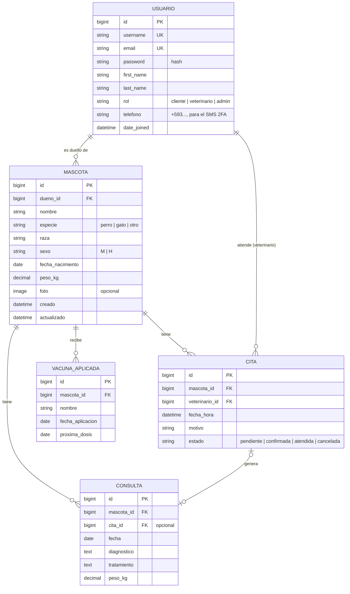

# Modelo de datos — Woof

> **Borrador para revisar con Adrián.** Lo marcado *Entrega 1* es lo mínimo para el lunes; lo demás es la proyección para las fases siguientes (no se programa todavía, pero conviene que el diseño ya lo contemple).

GitHub y VS Code muestran este diagrama directamente (mermaid). Si el profe pide imagen, cópienlo en https://mermaid.live y exporten PNG.

## Entrega 1: tablas que se programan ahora

### `cuentas.Usuario` (hereda de `AbstractUser`)
Ya trae username, email, password (con hash), first_name, last_name, is_active, is_staff, date_joined. Solo agregamos:

| Campo | Tipo Django | Notas |
|---|---|---|
| rol | `CharField(choices=...)` | `cliente` por defecto |
| telefono | `CharField(max_length=16)` | obligatorio, formato internacional `+593...`: ahí llega el código SMS del doble factor |
| email | `EmailField(unique=True)` | lo redefinimos para que sea único (lo necesitaremos para Google y 2FA) |

En `settings.py`: `AUTH_USER_MODEL = "cuentas.Usuario"` **antes de la primera migración propia**.

### `mascotas.Mascota`

| Campo | Tipo Django | Notas |
|---|---|---|
| dueno | `ForeignKey(settings.AUTH_USER_MODEL, on_delete=models.CASCADE, related_name="mascotas")` | se asigna solo en la vista |
| nombre | `CharField(max_length=60)` | obligatorio |
| especie | `CharField(max_length=10, choices=...)` | obligatorio |
| raza | `CharField(max_length=60, blank=True)` | |
| sexo | `CharField(max_length=1, choices=...)` | |
| fecha_nacimiento | `DateField(null=True, blank=True)` | no futura |
| peso_kg | `DecimalField(max_digits=5, decimal_places=2, null=True, blank=True)` | > 0 |
| foto | `ImageField(upload_to="mascotas/", blank=True)` | requiere Pillow; se puede dejar para después |
| creado / actualizado | `DateTimeField(auto_now_add / auto_now)` | |

## Decisiones de diseño
- **Usuario personalizado desde el inicio:** cambiar el modelo de usuario cuando ya hay migraciones obliga a borrar la base.
- **El dueño no viaja en el formulario:** la vista lo toma de `request.user`, así nadie puede crear mascotas a nombre de otro.
- **Todas las consultas filtran por dueño** (`Mascota.objects.filter(dueno=request.user)`), por eso la mascota de otro da 404.
- **Veterinario = Usuario con rol `veterinario`**, no otra tabla, para que todos usen el mismo login.
